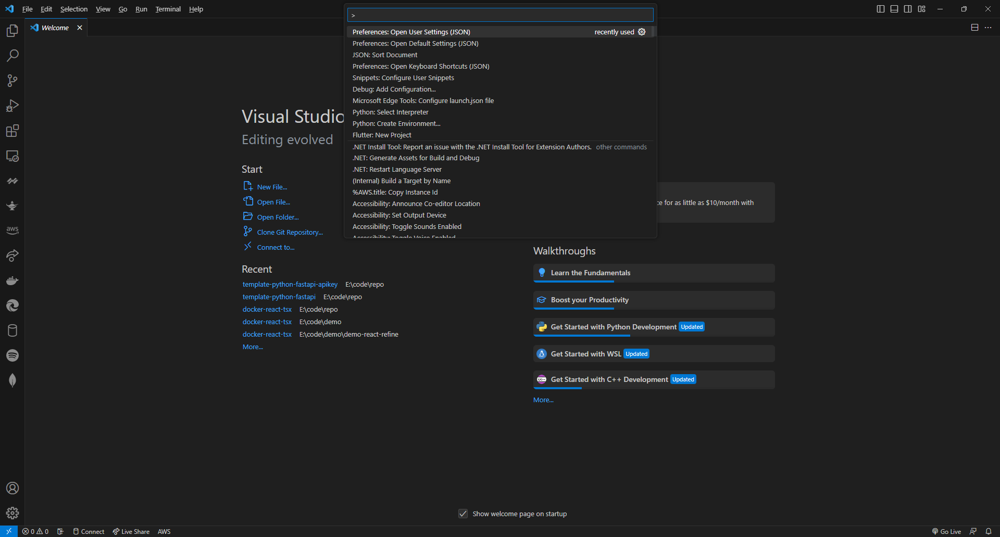
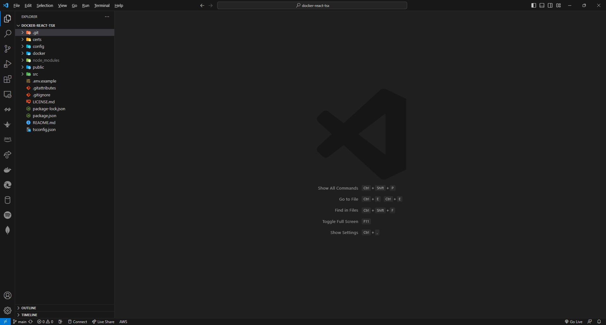

# 🌑 How to show Folder .git in Visual Studio Code


ในกรณีที่เราเขียน Program บน Visual Studio Code เราจะไม่สามารถเห็น ไฟล์ หรือ โฟลเดอร์ ที่ซ่อนอยู่ได้ ถึงแม้ว่าเราจะไปเลือก Show hidden files, folders, and drives ใน Folder Options แล้วก็ตาม


## **Get Started**

* กด Ctrl + Shift + P แล้วเลือก Preferences: Open User Settings (JSON)

<figure><figcaption></figcaption></figure>

* ทำการแก้ไขค่า Parameter จาก True เป็น False ในไฟล์ settings.json

```
"files.exclude": {
     "**/.git": false
}
```

* เราก็จะเห็นโฟลเดอร์ .git

<figure><figcaption></figcaption></figure>

**อ่านเพิ่มเติม** : [https://bit.ly/47mrozc](https://bit.ly/47mrozc)
