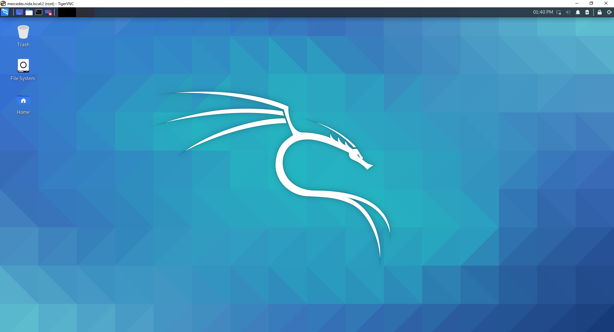

# 👿 Install Kali Linux GUI on Windows Subsystem for Linux


หลังจากที่ Microsoft ได้ออก WSL Version 2 ที่ใช้ Full Linux Kernel และ Full System Call Compatible ทำให้สามารถใช้งาน Kali Linux เวอร์ชั่น 2020.3 ที่ออกมาใหม่แบบ GUI ได้ โดยการติดตั้ง Win-Kex ซึ่งเราจะมาลองติดตั้งกัน


## **✅ Requirement**

* Enable Window Subsystem for Linux ( WSL )
* Upgrade Windows Subsystem for Linux ( WSL 2 )
* Re-Install Kali Linux Distro

## **🏆 Install**

* ทำการ Update และ Upgrade


```
apt-get update && apt-get upgrade -y
```


* ทำการติดตั้ง Package


```
apt-get install kali-win-kex -y
```


* ทำการแก้ไขไฟล์ /usr/bin/kex ให้ตรงกับค่า X Display


```
vi /usr/bin/kex
```


```
FullScreen=1 127.0.0.1:2
```

* ทำการ Start Service Kex


```
kex
```


* จะแสดง Kali Linux GUI

<figure><figcaption></figcaption></figure>

**อ่านเพิ่มเติม** : [https://bit.ly/3hna1ny](https://bit.ly/3hna1ny)
