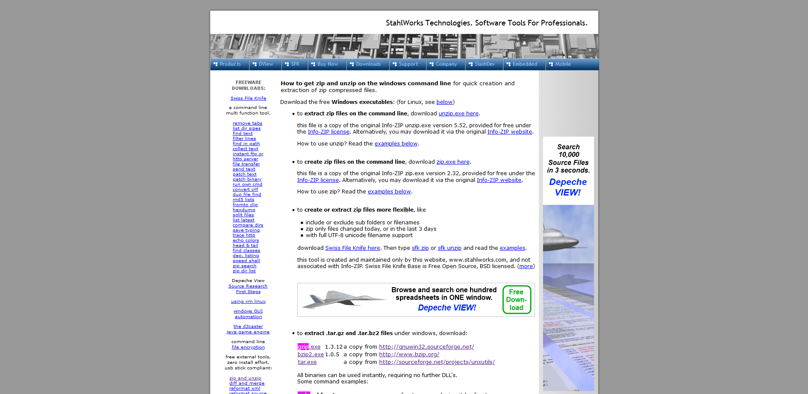
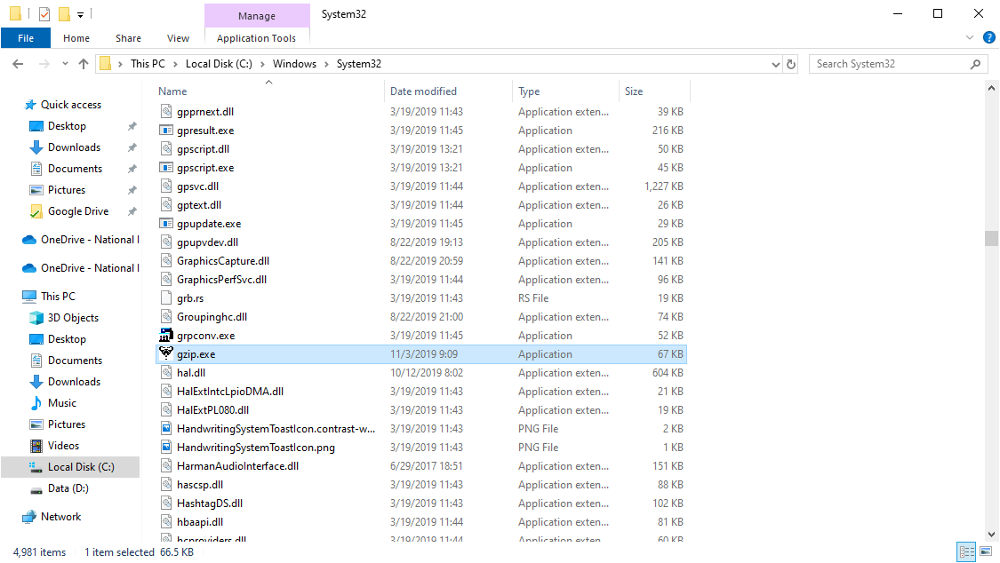

# 👽 How to decompress GZIP, BZIP and TAR File on Windows 10


ในกรณีทื่เราทำการ Export Data Pump ไฟล์จากเครื่อง Oracle Database Server ที่ถูก Compress ไฟล์ด้วย GZIP ไปยังเครื่อง Oracle Database Client ที่เป็น Windows จะต้องทำการติดตั้ง GZIP บน Windows เพื่อใช้ในการ Decompress ไฟล์ หรือต้องทำการ Decompress ไฟล์ก่อนทำการ SCP ซึ่งจะทำให้ใช้เวลาในการ Transfer นานขึ้น


## **Download**

* [GZIP, BZIP and TAR for Windows](http://stahlworks.com/dev/index.php?tool=zipunzip)

## **Get Started**

* ทำการดาวน์โหลดและติดตั้ง GZIP, BZIP and TAR โดยเลือกดาวน์โหลดไฟล์ที่เป็น .exe ซึ่งจะถูก Compile เรียบร้อยแล้ว



* ทำการย้ายไฟล์ .exe ที่ดาวน์โหลด มาไว้ในโฟลเดอร์ C:\Windows\System32



* ลองทำการ Decompress ไฟล์


```
gzip -d orcl.dmp.gz
```

