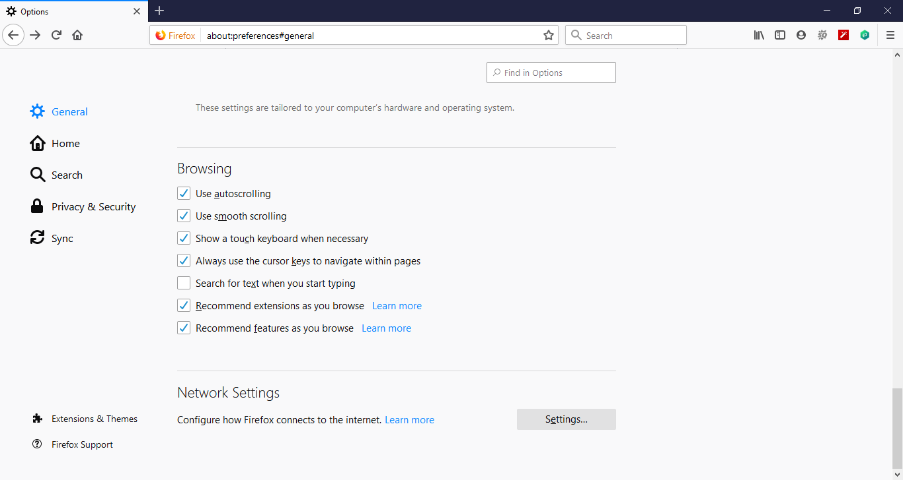
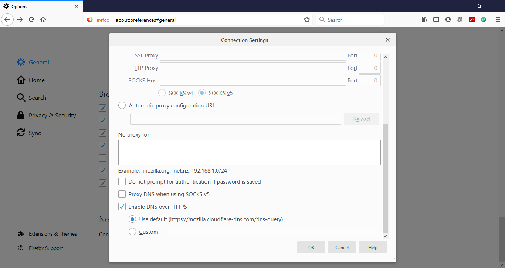

# 👽 How to enable DNS over HTTPS on Firefox


โดยปกติเวลาเครื่อง Client จะใช้งาน Internet จะทำการส่ง Request ไปยัง Service ที่เรียกว่า Domain Name Service ( DNS ) ทำหน้าที่บอกว่า Domain Name ที่ร้องขอมาเป็น IP อะไร เพื่อใช้ในการติดต่อ ซึ่งข้อมูลที่ร้องขอไปไม่ได้ทำการเข้ารหัส หากต้องการเข้า stackoverflow.com อาจมีการแก้ไขเป็น pornhub.com ก็ได้


## **DNS over HTTPS**


การเข้ารหัสด้วย DNS over HTTPS ( DoH ) จะต่างกับ DNSSEC ซึ่งจะเกี่ยวกับ Data Integrity ความถูกต้องของข้อมูลด้วย Signature ส่วน DoH จะเกี่ยวกับ Data Confidentiality การรักษาความลับของข้อมูล ซึ่งจะเป็น Concept ของ Information Security ( CIA ) ทำให้การ Enable DNS over HTTPS จะช่วยป้องกันการดักจับข้อมูลและการปลอมแปลงข้อมูล ซึ่งถูกมองว่าเป็นภัยทาง Internet เนื่องจาก ISP ไม่สามารถทำการ Block เว็บไซต์ได้


## **Get Started**

* เปิด Firefox -> Options -> General -> Network Setting แล้วคลิก Settings

* เลือก Enable DNS over HTTPS แล้วคลิก OK

**อ่านเพิ่มเติม** : [https://mzl.la/2H7Hf7j](https://mzl.la/2H7Hf7j)
