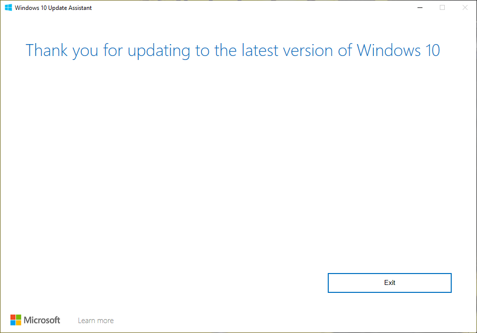
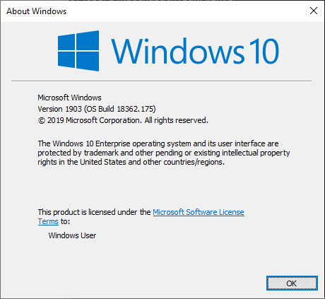

# 👽 Upgrade Windows 10 Version 1803 to 1903


หากใครเคยเล่น WSL บน Windows จะสามารถทำการ Export and Import Distro ต่าง ๆ ได้ แต่การจะใช้งานนั้นจะต้องทำการ Upgrade Windows ให้เป็น Version 1903 ขึ้นไป โดยจะทำการ Upgrade ผ่านโปรแกรมช่วยติดตั้ง


## **Download**

* [Update Assistant](https://www.microsoft.com/en-us/software-download/windows10)

## **Get Started**

* ทำการดาวน์โหลดและติดตั้ง Update Assistant แล้วคลิก Update Now

.png>)

* คลิก Next

.png>)

* คลิก Minimize

.png>)

* หากทำการติดตั้ง VMware Workstation Pro ให้ทำการ Uninstall แล้วทำการติดตั้ง Update Assistant อีกครั้ง

.png>)

* เลือก Continue from where I left off แล้วคลิก Next

.png>)

* ระบบขะทำการติดตั้ง ตอนนี้จะยังไม่ได้ Restart

.png>)

* รอจนติดตั้งเสร็จ แล้วคลิก Restart Now

.png>)

* คลิก Exit

* ทำการตรวจสอบ Windows Version

**อ่านเพิ่มเติม** : [https://bit.ly/2JvFXXM](https://bit.ly/2JvFXXM)
