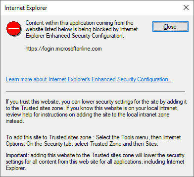
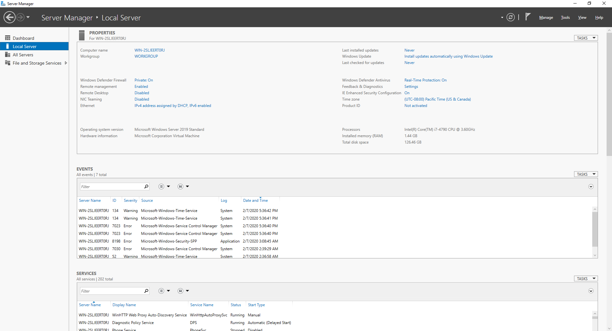
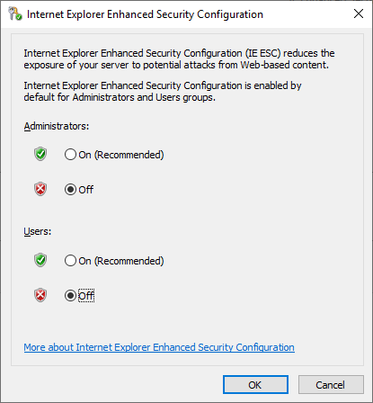

# 👺 Fix Internet Explorer Block Website on Windows Server 2019


ในกรณีที่เราทำการ Install Windows Server 2019 จะไม่สามารถเข้าใช้งาน Website ต่าง ๆ บน Browser ได้ หรือแม่แต่กระทั่งการเข้าถึง Website จาก Windows Application ก็ไม่สามารถทำได้เช่นกัน เนื่องจากถูก Block ด้วย Internet Explorer Enhanced Security





**Cause** : สาเหตุเนื่องมาจาก Internet Explorer ทำการ Block Content ของ Website เพื่อป้องกันการโจมตีผ่านทางเว็บไซต์ ซึ่งเราสามารทำการ Disable Enhanced Security Configuration ได้ 2 วิธี คือ 1. Disable Internet Explorer Enhanced Security Configuration ( IE ESC ) 2. Disable Feature Internet Explorer แล้วใช้ Browser อื่นแทน เช่น Chrome, Firefox


## **Configuration**

### Solution 1&#x20;

* ทำการ Disable Internet Explorer Enhanced Security Configuration บน Server Manager คลิก IE Enhanced Security Configuration



* เลือก Off แล้วคลิก OK



### Solution 2&#x20;

* ทำการ Get Feature Internet Explorer


```
Dism /online /Get-FeatureInfo /FeatureName:Internet-Explorer-Optional-amd64
```


```
Deployment Image Servicing and Management tool
Version: 10.0.17763.1

Image Version: 10.0.17763.379

Feature Information:

Feature Name : Internet-Explorer-Optional-amd64
Display Name : Internet Explorer 11
Description : Finds and displays information and Web sites on the Internet.
Restart Required : Required
State : Enabled

Custom Properties:

SoftBlockLink : http://go.microsoft.com/fwlink/?LinkID=142507

The operation completed successfully.
```

* ทำการ Disable Feature Internet Explorer


```
Dism /online /Disable-Feature /FeatureName:Internet-Explorer-Optional-amd6
```


**อ่านเพิ่มเติม** : [https://bit.ly/39k9GO1](https://bit.ly/39k9GO1)
