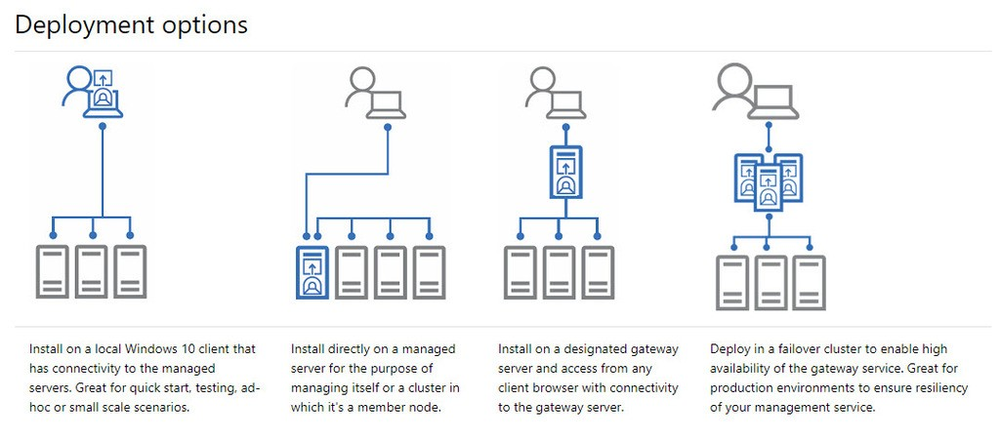
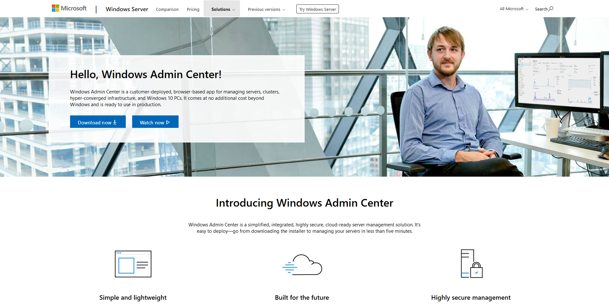
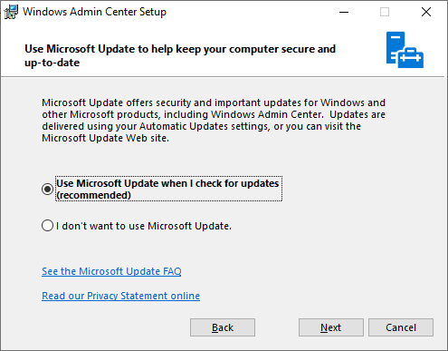
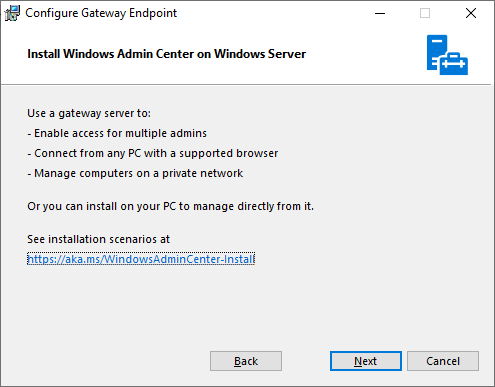
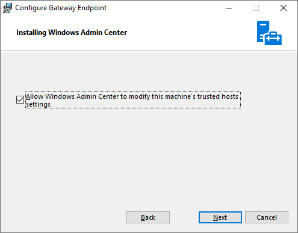
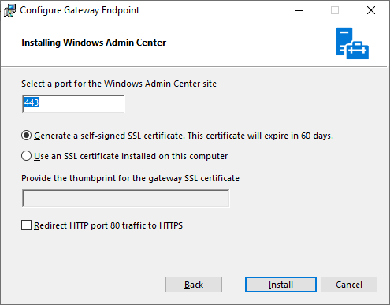
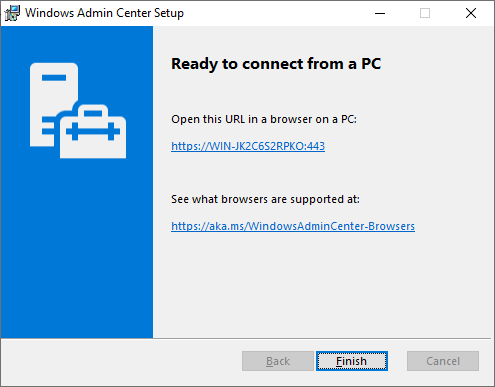
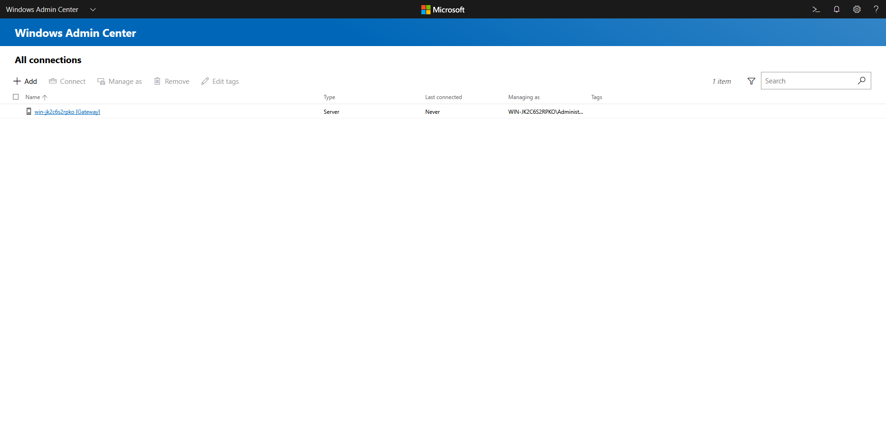
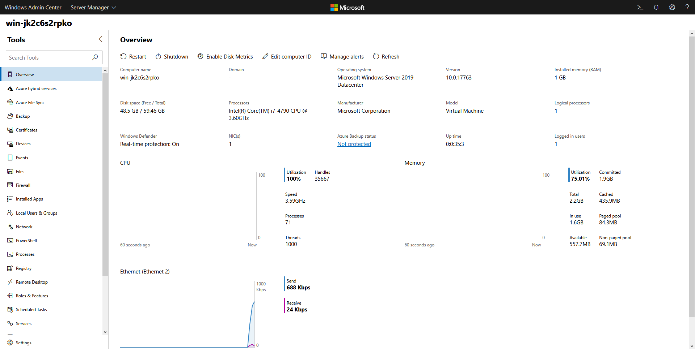

# 👺 Install Windows Admin Center on Windows Server 2019


Windows Admin Center ( WAC ) เป็น Web Application ที่ใช้ในการจัดการ Server, Cluster และ HCI ซึ่งสามารถติดตั้งใน Windows Server รุ่นใหม่ ๆ ตั้งแต่ 2012 ขึ้นไป โดยจะเป็นการติดตั้งแบบ Gateway Mode และสามารถติดตั้งใน Windows 10 แต่จะเป็นการติดตั้งแบบ Desktop Mode


## **Download**

* [Windows Admin Center](https://www.microsoft.com/en-us/cloud-platform/windows-admin-center)

## **Install**

* เข้าไปที่หน้าเว็บ [https://www.microsoft.com/en-us/cloud-platform/windows-admin-center](https://www.microsoft.com/en-us/cloud-platform/windows-admin-center)

* เลือก Accept แล้วคลิก Next

* เลือก Use Microsoft Update แล้วคลิก Next

* คลิก Next

* เลือก Allow Windows Admin Center แล้วคลิก Next

* เลือก Generate a self-signed SSL Certificate ใช้ Port Default แล้วคลิก Next

* คลิก Finish

* ลองเข้าไปที่ [https://localhost/](https://localhost/)

* สามารถทำการ Remote ไปที่เครื่องที่ต้องการ เพื่อควบคุมเครื่องได้ทั้งหมด

**อ่านเพิ่มเติม** : [https://bit.ly/2HkvWwJ](https://bit.ly/2HkvWwJ)
