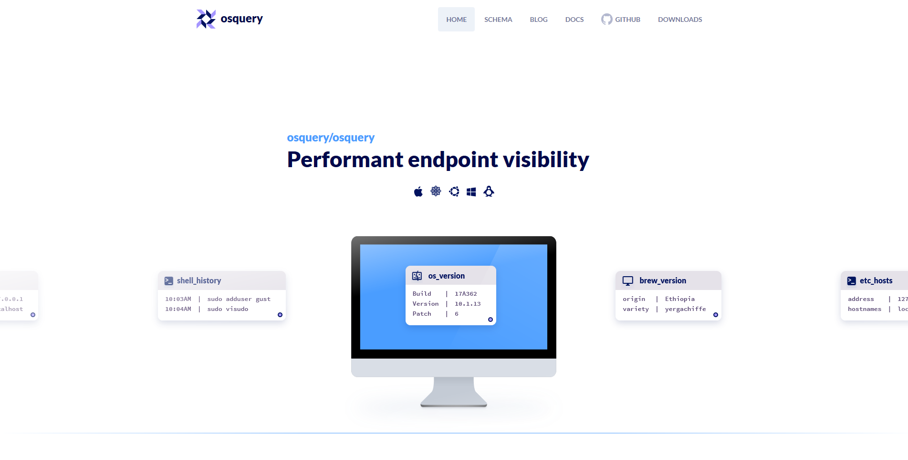

# 👺 OSQuery


Operating System Instrumentation Framework ( OSQuery ) เป็น Open Source Framework ของทาง Facebook ที่ออกแบบมาสำหรับการ Monitoring & Analytic ในระดับ Low-Level ของ Operating System โดยสามารถดึงข้อมูลในลักษณะของภาษา SQL สามารถใช้งานได้ทั้ง Windows, Linux และ Mac


## **Download**

* [OSQuery](https://osquery.io/)

## **Get Started**

* ทำการดาวน์โหลดและติดตั้ง OSQuery



* ทำการรัน OSQuery


```
osqueryi
```


* ลองทำการตรวจสอบ System Info


```
SELECT hostname, cpu_brand FROM system_info ;
```


```
+--------------------+-----------------------------------------+
| hostname           | cpu_brand                               |
+--------------------+-----------------------------------------+
| mercedes.lab.local | Intel(R) Core(TM) i7-4790 CPU @ 3.60GHz |
+--------------------+-----------------------------------------+
```

* ลองทำการตรวจสอบ CPU Info


```
SELECT model, number_of_cores FROM cpu_info ;
```


```
+-----------------------------------------+-----------------+
| model                                   | number_of_cores |
+-----------------------------------------+-----------------+
| Intel(R) Core(TM) i7-4790 CPU @ 3.60GHz | 4               |
+-----------------------------------------+-----------------+
```

* ลองทำการตรวจสอบ Disk Info


```
SELECT type, disk_size, hardware_model, serial FROM disk_info WHERE type = 'SCSI' ;
```


```
+------+---------------+--------------------+------------------+
| type | disk_size     | hardware_model     | serial           |
+------+---------------+--------------------+------------------+
| SCSI | 240054796800  | KINGSTON SHSS37A2G | 50026B767B02C851 |
| SCSI | 2000396321280 | WDC WD20EZRX-00PB0 | WD-WMC4M2830919  |
+------+---------------+--------------------+------------------+
```

* ลองทำการตรวจสอบ OS Version


```
SELECT name, version, build FROM os_version ;
```


```
+---------------------------------+------------+-------+
| name                            | version    | build |
+---------------------------------+------------+-------+
| Microsoft Windows 10 Enterprise | 10.0.18362 | 18362 |
+---------------------------------+------------+-------+
```

* ลองทำการตรวจสอบ Logon Session


```
SELECT logon_id, user, logon_domain, datetime(logon_time,'unixepoch') as datetime FROM logon_sessions ;
```


```
+----------+----------+--------------+---------------------+
| logon_id | user     | logon_domain | datetime            |
+----------+----------+--------------+---------------------+
| 17260279 | lablocal | LAB          | 2019-11-14 00:41:51 |
+----------+----------+--------------+---------------------+
```

* ลองทำการตรวจสอบ Uptime


```
SELECT * FROM uptime ;
```


```
+------+-------+---------+---------+---------------+
| days | hours | minutes | seconds | total_seconds |
+------+-------+---------+---------+---------------+
| 4    | 8     | 1       | 30      | 374490        |
+------+-------+---------+---------+---------------+
```

* ลองทำการตรวจสอบ ARP Table


```
SELECT address, mac, COUNT(mac) AS mac_count FROM arp_cache GROUP BY mac HAVING count(mac) > 1 ;
```


```
+-----------------+-------------------+-----------+
| address         | mac               | mac_count |
+-----------------+-------------------+-----------+
| 224.0.0.2       | 01:00:5E:00:00:02 | 8         |
| 224.0.0.22      | 01:00:5E:00:00:16 | 8         |
| 224.0.0.251     | 01:00:5E:00:00:FB | 8         |
| 224.0.0.252     | 01:00:5E:00:00:FC | 6         |
| 239.255.255.250 | 01:00:5E:7F:FF:FA | 8         |
| 255.255.255.255 | FF:FF:FF:FF:FF:FF | 13        |
+-----------------+-------------------+-----------+
```

* ลองทำการตรวจสอบ CA


```
SELECT common_name, datetime(not_valid_after,'unixepoch') as expire_datetime, signing_algorithm FROM certificates GROUP BY common_name;
```


```
+--------------+---------------------+-------------------+
| common_name  | expire_datetime     | signing_algorithm |
+--------------+---------------------+-------------------+
| *.nida.ac.th | 2019-12-07 10:22:43 | sha256RSA         |
+--------------+---------------------+-------------------+
```

* ลองทำการตรวจสอบ Process


```
SELECT DISTINCT process.name, listening.port, process.pid FROM processes AS process JOIN listening_ports AS listening ON process.pid = listening.pid WHERE listening.address = '0.0.0.0' ;
```


```
+----------+-------+-------+
| name     | port  | pid   |
+----------+-------+-------+
| Spotify  | 57621 | 001   |
| ARDAgent | 3283  | 002   |
+----------+-------+-------+
```

* ลองทำการตรวจสอบ OS Patch


```
SELECT hotfix_id, description, installed_on FROM patches ;
```


```
+-----------+-----------------+--------------+
| hotfix_id | description     | installed_on |
+-----------+-----------------+--------------+
| KB4519573 | Update          | 11/6/2019    |
| KB4497165 | Update          | 6/12/2019    |
| KB4498523 | Security Update | 6/12/2019    |
| KB4503308 | Security Update | 6/12/2019    |
| KB4516115 | Security Update | 10/31/2019   |
| KB4521863 | Security Update | 10/30/2019   |
| KB4524569 | Security Update | 11/13/2019   |
| KB4524570 | Update          | 11/13/2019   |
+-----------+-----------------+--------------+
```

**อ่านเพิ่มเติม** : [https://bit.ly/2OpnWw3](https://bit.ly/2OpnWw3)
