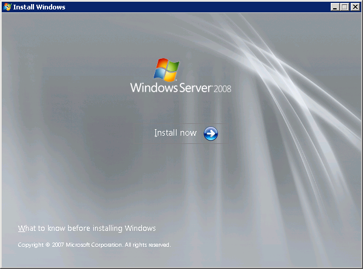
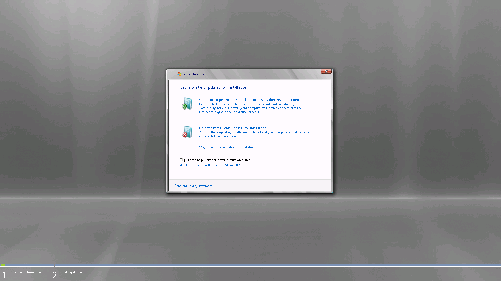
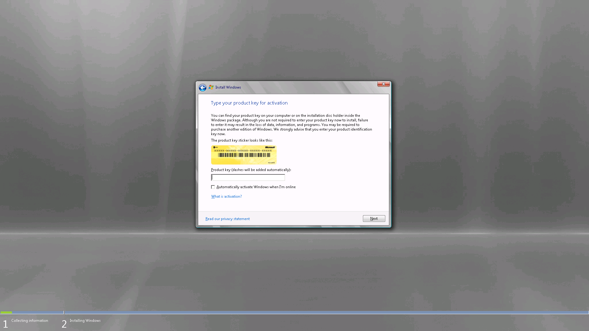
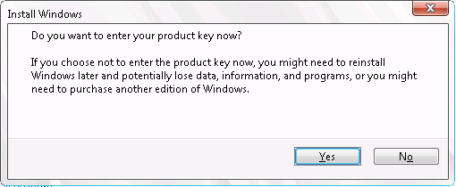
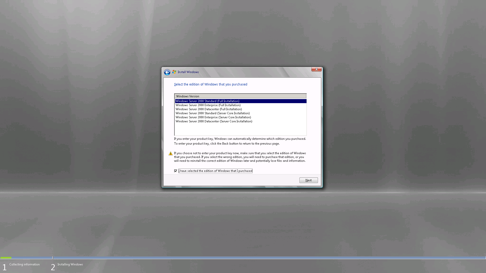
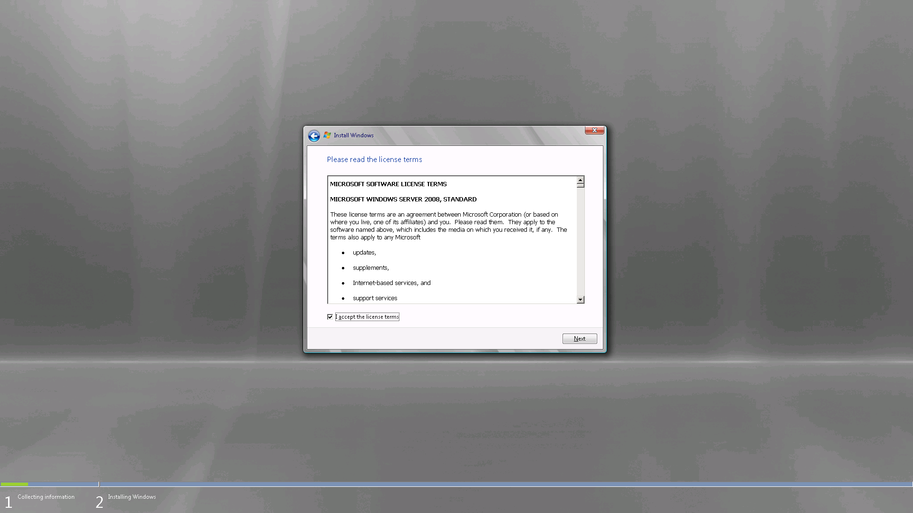
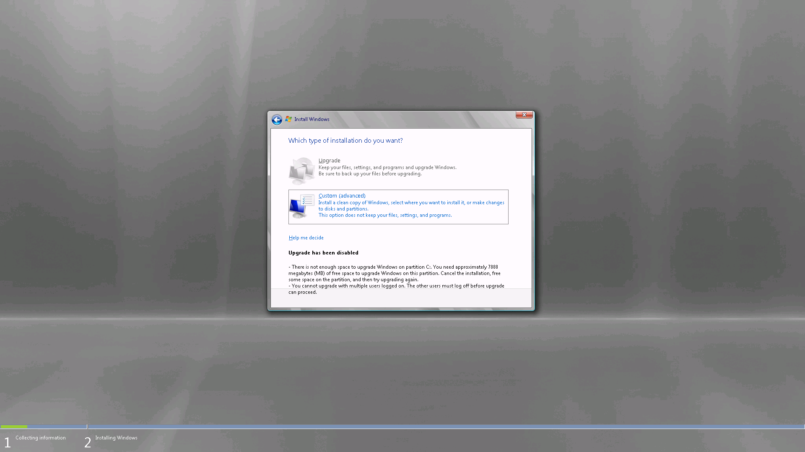

# 👺 Upgrade Windows Server 2003 SP2 to Windows Server 2008 R2


ในกรณีที่เราทำการ Upgrade OS บนระบบปฏิบัติการ Windows Server รุ่นเก่าอย่าง 2003 ซึ่ง End-of-Support ไปนานแล้ว โดยระบบปฎิบัติการขั้นต่ำนั้นควรจะเป็น Windows Server 2008 R2 ขึ้นไป เนื่องจากมี Powershell ทำให้เราเขียน Script ได้ง่าย แต่แนะนำให้เป็น Windows Server 2016 หรือ 2019 ไปเลยจะดีกว่า


## **✅ Requirement**

* Check Windows Server 2003 SP2
* Check Free Space Disk on Drive C:
* Check OS 32-bit or 64-bit
* [Windows Server 2008 Standard, Enterprise](https://www.microsoft.com/en-us/download/details.aspx?id=5023)

## **🏆 Get Started**

* คลิก Install

* ทำการ Uncheck Help ออก แล้วคลิก Go online to get the latest updates for installation

* ทำการ Uncheck Automatically activate Windows ออก แล้วคลิก Next

* คลิก No

* เลือก Windows Server 2008 Standard (Full Installation) แล้วคลิก Next คำเตือนเลือกให้ตรงกับ Windows Version เดิม ถ้าเป็น Enterprise เลือก Enterprise

* ทำการ Check I accept the license terms แล้วคลิก Next

* กรณีที่ไม่สามารถคลิก Upgrade ได้ อาจเกิดจาก Open Remote Desktop ให้ทำการ Close Connection แล้วไปทำหน้า Console แทน

**อ่านเพิ่มเติม** : [https://bit.ly/3g6ncYx](https://bit.ly/3g6ncYx)
