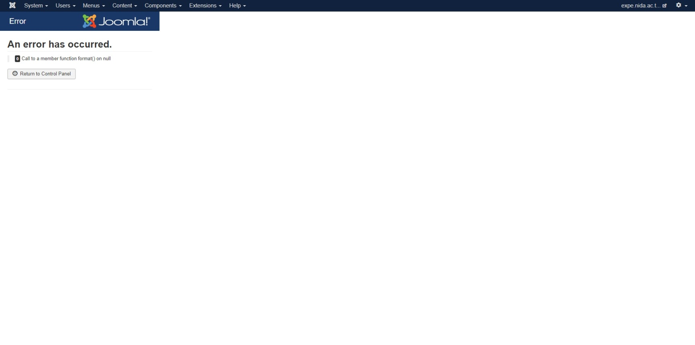
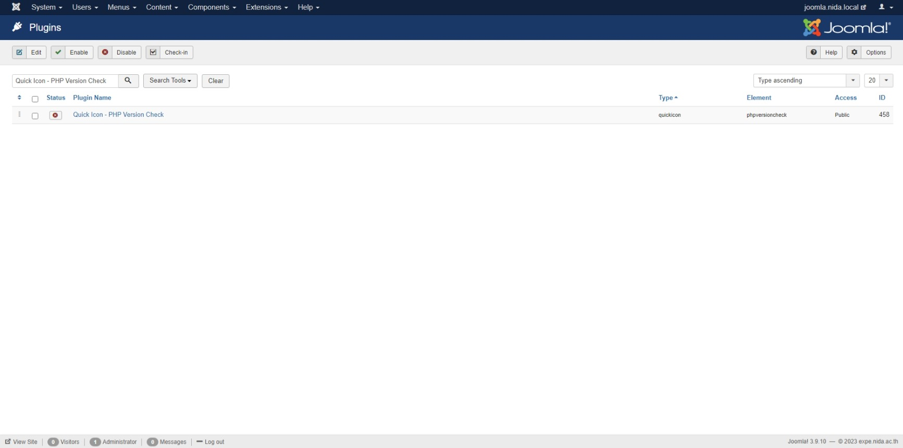

# 🌺 Fix Joomla Error Call to a member function


ในกรณีที่เราเข้าใช้งาน Joomla ผ่านทางหลังบ้านในหน้า Administrator หลังจากที่มีการติดตั้งหรือมีการอัพเดทเวอร์ชั่น บางครั้งอาจเจอ Warning หรือ Error ที่ทำให้ไม่สามารถเรียกดูหรือใช้งานฟังก์ชั่นต่างๆ ในเมนูนั้นได้


<figure><figcaption></figcaption></figure>


**Cause** : สาเหตุเนื่องมาจาก PHP Deprecated Function ทำให้ในหน้า Administrator ของ Joomla ไม่สามารถคลิกเมนู System ได้ แต่สามารถคลิกเมนูอื่นได้ปกติ


## **Configuration**

* ทำการคลิก Extensions -> Plugins แล้วทำการ Disable ปลั๊กอิน Quick Icon – PHP Version Check

<figure><figcaption></figcaption></figure>

**อ่านเพิ่มเติม** : [https://bit.ly/43gry8I](https://bit.ly/43gry8I)
