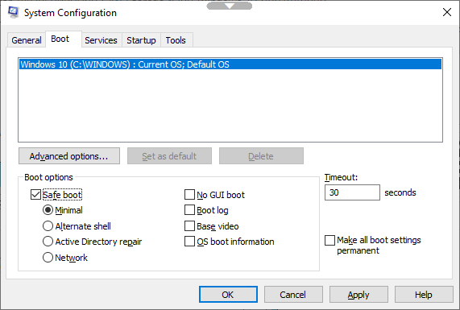
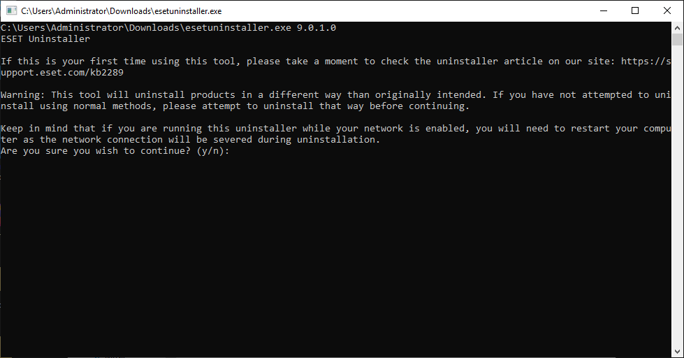

# 🐕🦺 Fix can’t Uninstall ESET Management Agent


ในกรณีที่เราทำการ Deploy ESET Security Management Center เป็นเวอร์ชั่น 7 เราจะไม่สามารถทำการ Uninstall ESET Management Agent ในเวอร์ชั่น 6 และ 5 ด้วยวิธีการปกติได้ เนื่องจากมีการเปลี่ยน Agent ทำให้ Agent เก่าชี้ไปยัง Server ที่ไม่มีอยู่จริง ทำให้ตอน Uninstall จะต้องทำการลบค่า Registry ด้วย



**Cause** : สาเหตุเนื่องมาจาก ESET Security Management Center มีการเปลี่ยน Agent ทำให้ไม่สามารถ Uninstall ได้ จะต้องทำการลบค่า Registry ด้วย ซึ่งมีวิธีแก้ 2 วิธี คือ 1. กรณีที่เป็นเวอร์ชั่น 6 เราสามารถใช้ Script แล้วสั่งลบผ่านทาง Group Policy Object ( GPO ) บน Active Directory พร้อมกันหลาย ๆ เครื่องได้ 2. กรณีที่เป็นเวอร์ชั่น 5&#x20;


## **Configuration**

### Solution 1&#x20;

* ทำการดาวน์โหลด Script บน [Github](https://github.com/Cat5TV/eset/blob/master/uninstallers/eset-uninstall-agent.bat)

```
C:\> git clone https://github.com/Cat5TV/eset.git
C:\> cd eset/uninstallers
```

* ทำการรัน Script

```
C:\eset\uninstallers> eset-uninstall-agent.bat
```

### Solution 2&#x20;

* ทำการดาวน์โหลด [ESET Uninstaller](https://download.eset.com/com/eset/tools/installers/eset\_apps\_remover/latest/esetuninstaller.exe) แล้วทำการ Restart Computer แบบ Safe Mode



* ทำการรัน ESET Uninstaller คลิกขวา Run as Administrator



**อ่านเพิ่มเติม** : [https://bit.ly/2FbO2C7](https://bit.ly/2FbO2C7), [https://bit.ly/33dFHG7](https://bit.ly/33dFHG7)
