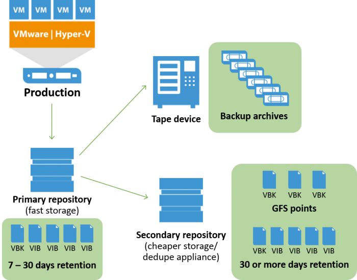

# 🧊 Backup Planning Matrix


ในกรณีที่เราทำการ Backup VM หรือทำการ Backup Data ต่าง ๆ เราจะต้องตอบคำถามว่าทำไมเราถึงเลือกวิธีการสำรองข้อมูล ( Backup Type ) แบบนั้น มันดียังไง ทำไมกำหนดความถี่ในการสำรองข้อมูลแบบนั้น ( Backup of Frequency ) รวมถึงทำไมกำหนดรอบระยะเวลาในการจัดเก็บเท่านั้น ( Retention )


## **Backup Type**

| Backup Type  | Data               | Backup Time | Restore Time | Storage Size |
| ------------ | ------------------ | ----------- | ------------ | ------------ |
| Full         | All Data           | Slowest     | Fast         | High         |
| Incremental  | Only New Data      | Fast        | Medium       | Lowest       |
| Differential | All Data Last Full | Medium      | Fast         | Medium       |
| Mirror       | Only New Data      | Fastest     | Fastest      | Highest      |

## **3-2-1 Backup Rule**

## **Question**

ทำไมถึงต้อง Backup แบบ Incremental

เมื่อเปรียบเทียบการสำรองข้อมูลระหว่าง Backup Type ทั้ง 4 ประเภท จะเห็นว่า ถึงแม้ Restore Time จะต่ำกว่า Backup Type ประเภทอื่น ๆ แต่เวลาที่ใช้ก็อยู่ในระดับกลาง ๆ ซึ่งโดยปกติเราก็ไม่ค่อยได้ทำการ Restore อยู่แล้ว แต่ Backup นี่ทำทุกวัน อีกทั้งยังต้อสำรองข้อมูลหลายระบบ ดังนั้น Backup Time จึงต้องใช้เวลาให้สั้นที่สุด เพื่อไม่ให้กิน Bandwidth การใช้งาน โดยควรสำรองข้อมูลในขณะที่ไม่มีการใช้งาน เพื่อไม่ให้เกิดการแย่ง Bandwidth สุดท้าย Storage Size ใช้พื้นที่ในการสำรองข้อมูลน้อยสุดใน Backup Type ทั้งหมด

กำหนด Backup Job ยังไง

ของเดิมกำหนดตามความถี่ในการสำรองข้อมูล ( Backup of Frequency ) เช่น สำรองข้อมูลรายวัน ( Job-Daily ), สำรองข้อมูลรายสัปดาห์ ( Job-Weekly ), สำรองข้อมูลรายเดือน ( Job-Monthly ) โดย Backup Type เป็นแบบ Full ซึ่งถ้าหากปรับเป็น Incremental ทำให้ใช้ Storage Size น้อยลง เราสามารถกำหนดความถี่ในการสำรองข้อมูล ให้เป็นแบบสำรองข้อมูลรายวันได้ ซึ่งจะมีประโยชน์ตอนทำการ Restore โดยสามารถเลือก Restore Point ที่ต้องการได้แบบรายวัน แทนที่จะเป็นรายเดือนหรือรายสัปดาห์ ซึ่งข้อมูลจะหายไปตามความถี่ในการสำรองข้อมูล

กำหนด Retention ยังไง

ของเดิมกำหนดรอบระยะเวลาการจัดเก็บข้อมูลสัมพันธ์กับความถี่ในการสำรองข้อมูล ยิ่งความถี่บ่อยรายวันรอบระยะเวลาการจัดเก็บก็จะน้อย ถ้าความถี่เดือนหนึ่งรอบระยะเวลาการจัดเก็บก็จะนานตามไปด้วย เพราะถูกจำกัดด้วย Storage Size ซึ่งถ้าหากปรับเป็น Incremental แบบสำรองข้อมูลรายวัน เราจะสามารถกำหนด Retention ได้เยอะขึ้น โดยตามกฎของ 3-2-1 Backup Rule ที่ระบุให้ทำการสำรองข้อมูลไว้ 3 ชุด 2 อุปกรณ์ 1 Offline ซึ่งแนะนำให้ใช้ Retention อยู่ระหว่าง 7-30 วัน บน Primary Repository หากต้องการเก็บนานกว่านั้นให้ไปใช้ Secondary Repository แทน

**อ่านเพิ่มเติม** : [https://bit.ly/2mg5Dij](https://bit.ly/2mg5Dij)
