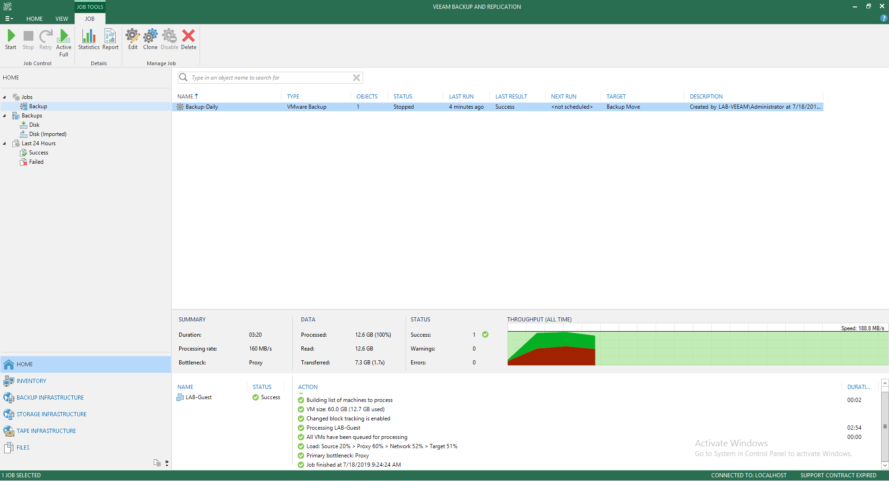

# 🧊 Fix Veeam Backup Error Full Backup File Merge Failed


ในกรณีที่เราทำการ Change Backup Location โดยนำ Backup File ที่เก็บไว้ใน Repository หนึ่ง ไปเก็บไว้ในอีก Repository หนึ่ง อาจส่งผลให้หา Full Point ของ Backup File ไม่เจอ ทำให้ไม่สามารถ Backup ต่อได้



**Cause** : สาเหตุเนื่องมาจาก Veeam Backup หา Full Point ของ Backup File ไม่เจอ ทำให้ไม่สามารถ Backup ต่อได้ กรณีที่ทำการ Backup แบบ Incremental ซึ่งจะคล้าย ๆ กับ กรณีที่หา RefID ของ VM ไม่เจอ โดยสามารถทำการแก้ไขโดยการสั่ง Full Backup


## **Configuration**

* ทำการเปิดโปรแกรม Veeam Backup แล้วคลิก Active Full

**อ่านเพิ่มเติม** : [https://bit.ly/2GfLf8k](https://bit.ly/2GfLf8k)
