# 🧊 Install Veeam Backup & Replication 11 on Windows


Veeam Backup & Replication เป็นเครื่องมือที่ใช้ในการทำ Backup & Recovery ของ VM ซึ่งมีมาถึง Version 11 ที่มาพร้อมกับ Feature ใหม่ อย่างเช่น Continuous Data Protection ( CDP ) ทำให้ได้ Near Zero RPO เมื่อเกิดเหตุการณ์ Data Loss ข้อมูลสูญหาย, Ransomware Protection และยังมีเมนู REST API ที่พร้อมให้เรียกใช้งานอีกด้วย


## **Requirement**

* Support Windows Server 2008 +

## **Download**

* [Veeam Backup & Replication 11](https://www.veeam.com/backup-replication-new-download.html)

## **Install**

* ติดตั้งจากไฟล์ iso คลิก Install

<figure>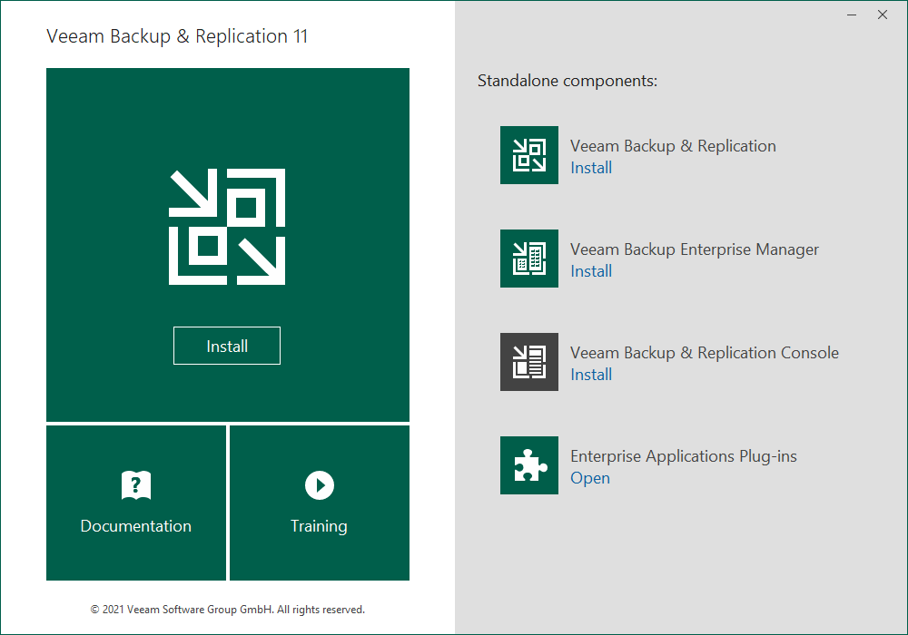<figcaption></figcaption></figure>

* เลือก Accept แล้วคลิก Next

<figure>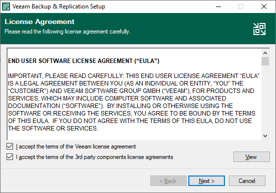<figcaption></figcaption></figure>

* ใส่ License ถ้าไม่มีก็สามารถคลิก Next ต่อไปได้เลย แต่จะเป็นการทดลองใช้งาน 30 วัน

<figure>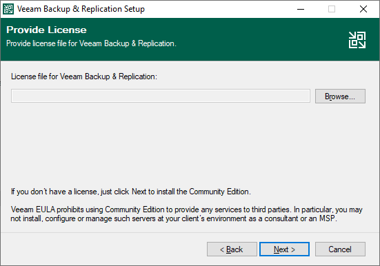<figcaption></figcaption></figure>

* ระบุ Path ที่ติดตั้ง แล้วคลิก Next

<figure>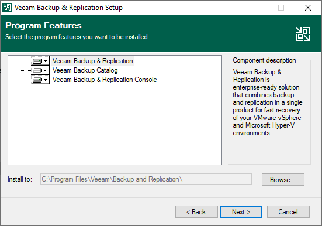<figcaption></figcaption></figure>

* จำเป็นจะต้องติดตั้ง SQL Server คลิก Install

<figure>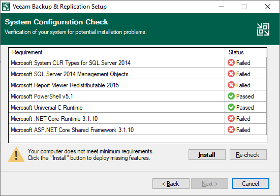<figcaption></figcaption></figure>

* คลิก Next

<figure>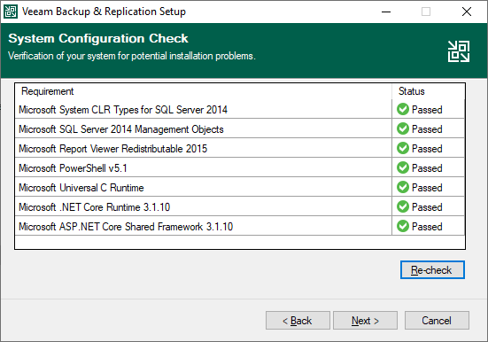<figcaption></figcaption></figure>

* คลิก Install

<figure>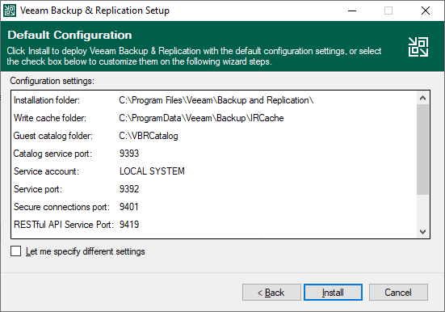<figcaption></figcaption></figure>

* ขั้นตอนการ Install จะนานนิดนึง

<figure>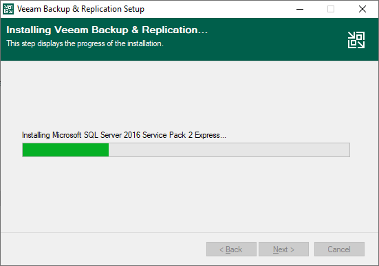<figcaption></figcaption></figure>

* คลิก Finish

<figure>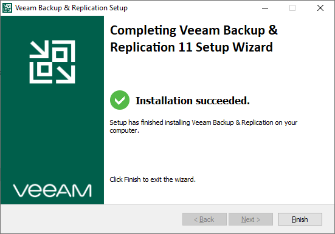<figcaption></figcaption></figure>

* เปิด Veeam Backup & Replication ขึ้นมา แล้วคลิก Connect

<figure>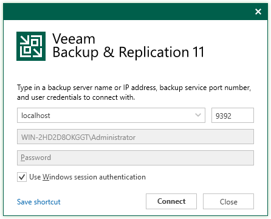<figcaption></figcaption></figure>

* ทำการ Update Component ให้เรียบร้อย แล้วคลิก Finish

<figure>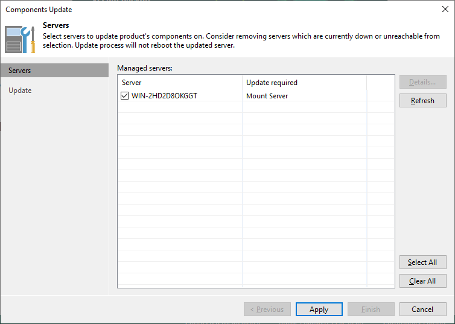<figcaption></figcaption></figure>

* เป็นอันเสร็จเรียบร้อยในการติดตั้ง

<figure>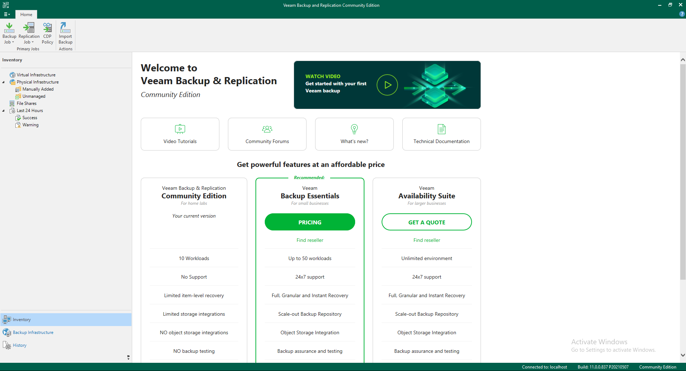<figcaption></figcaption></figure>
