# 🌠 Convert VMDK to VHDX with StarWind V2V Converter


หลังจากที่ได้ลองเล่น Hyper-V ก็รู้สึกติดใจ Interface ในการใช้งาน และด้วยความเป็น Software ที่ติดมากับ Microsoft ทำให้การใช้งานระหว่างเครื่อง Host กับ VM ไม่จำเป็นต้องลง VMware Tools เหมือนการใช้งานบน VMware Workstation แถมมี Software ที่ช่วยในการ Convert จาก VMDK มาเป็น VHDX ด้วย ซึ่งของ Microsoft เองก็มีเช่นกัน แต่เราจะมาลองของ StarWind กันก่อน เพราะชอบ Interface ของโปรแกรม


## **Download**

* [StarWind V2V Converter](https://www.starwindsoftware.com/starwind-v2v-converter#download)

## **Get Started**

* เลือก Accept แล้วคลิก Next

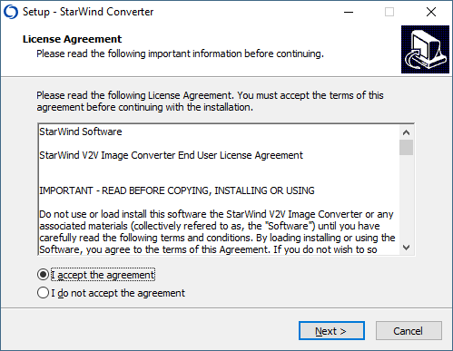

* คลิก Next

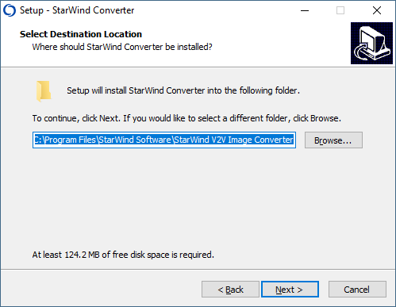

* คลิก Next

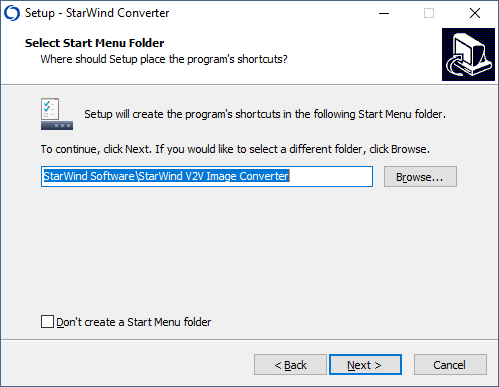

* คลิก Next

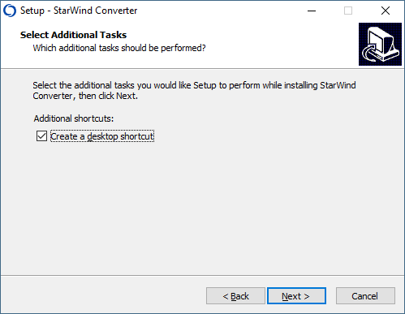

* คลิก Install

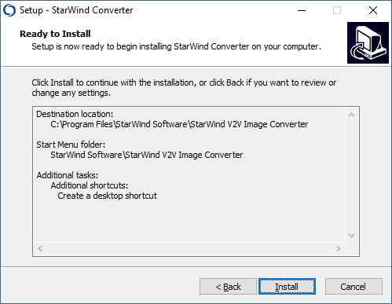

* คลิก Finish

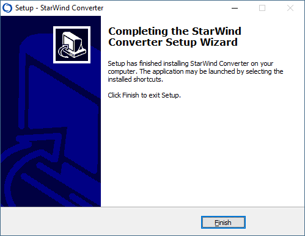

* เปิดโปรแกรม StarWind V2V Converter เลือก Local file แล้วคลิก Next

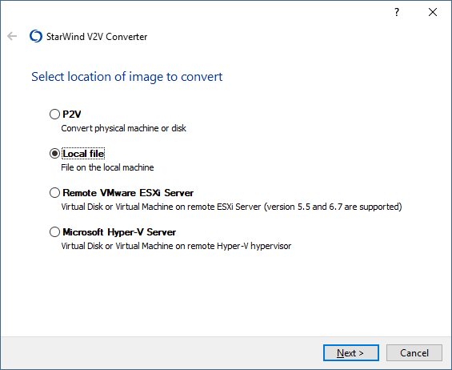

* ทำการระบุ Source File ( VMDK ) แล้วคลิก Next

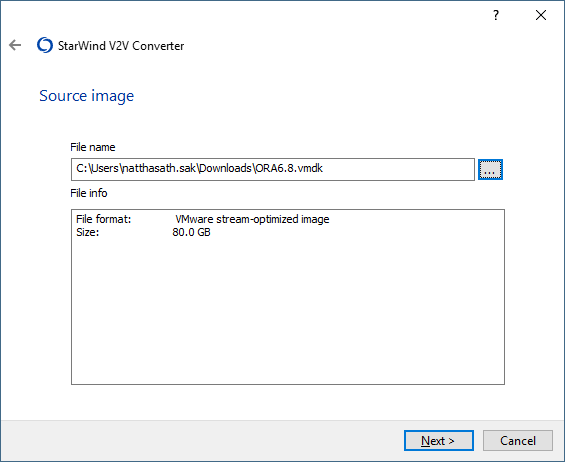

* เลือก Local file แล้วคลิก Next

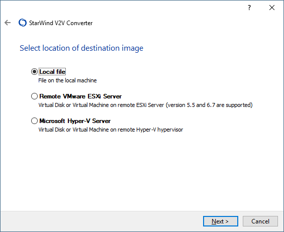

* เลือก VHD / VHDX แล้วคลิก Next

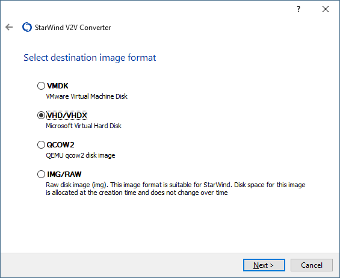

* เลือก VHDX growable image แล้วคลิก Next

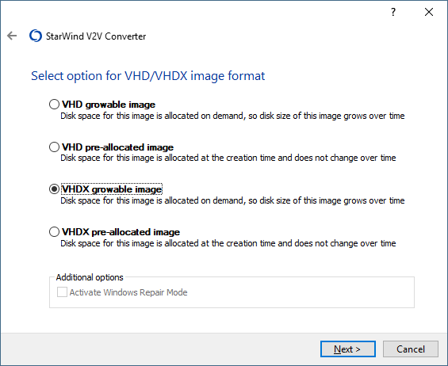

* ทำการระบุ Destination File ( VHDX ) แล้วคลิก Next

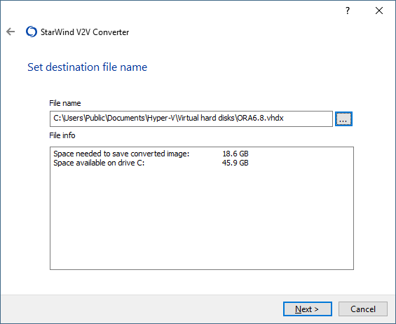

* &#x20;รอจนโปรแกรมทำการ Convert เสร็จ แล้วคลิก Finish

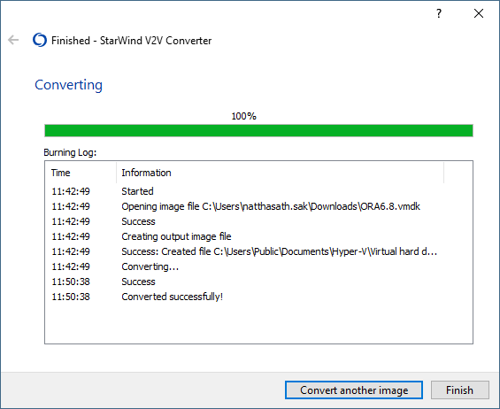
