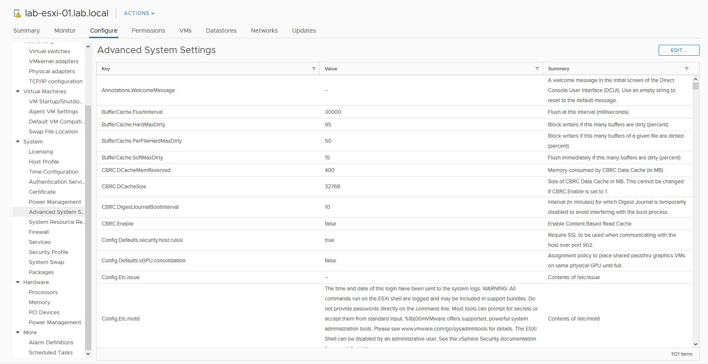
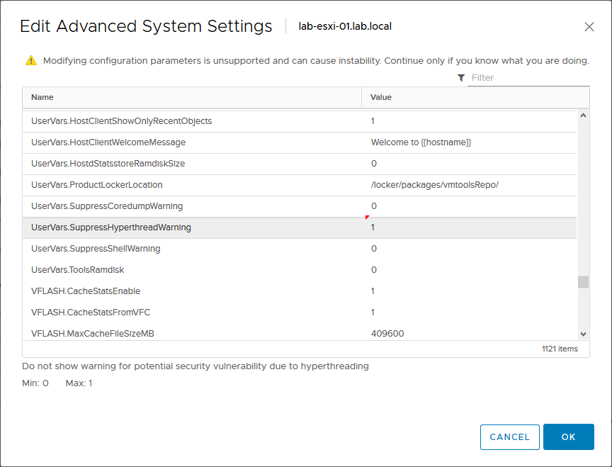

# 🌠 Fix Alert Hyperthreading Unmitigated on VMware ESXi 6.7


ในกรณีที่เราทำการ Upgrade VMware ESXi เป็น 6.7 พร้อมกับ Update Patch [VMSA-2018-0020](https://www.vmware.com/security/advisories/VMSA-2018-0020.html) ตาม VMware Security Advisor จะขึ้นข้อความ Info Message ว่า Hyperthreading Unmitigated ซึ่งอาจสร้างความรำคาญ และ ความไม่สบายใจ แต่สามารถทำการ Disable Notification ได้



**Cause** : สาเหตุเนื่องมาจาก CVE-2018-3646 มีการเปิดใช้งาน Hypervisor-Specific Mitigations เพื่อแก้ไขช่องโหว่ VMM สำหรับ L1 Terminal Fault ( L1TF ) ซึ่งเป็น 3 ช่องโหว่ของ Intel CPU ที่อนุญาติให้เข้าถึงข้อมูลบน L1 Cache ได้ ซึ่งมีวิธีแก้ 2 วิธี คือ 1. ทำการ Upgrade vCenter 2. ทำการ Disable Notification


## **Configuration**

* เลือก Configure -> Advance System Settings แล้วคลิก Edit

* ทำการเปลี่ยนค่า Parameter ที่ชื่อ UserVars.SuppressHyperthreadWarning เป็น 1 ตามนี้

**อ่านเพิ่มเติม** : [https://bit.ly/3aGHVRp](https://bit.ly/3aGHVRp)
