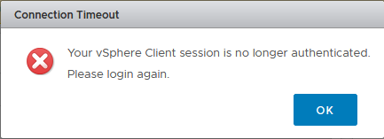
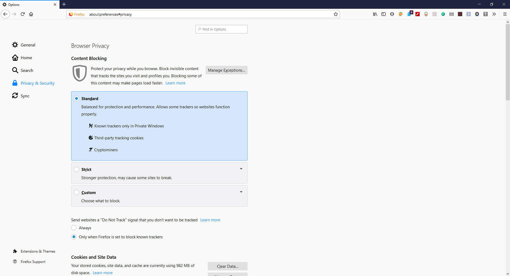
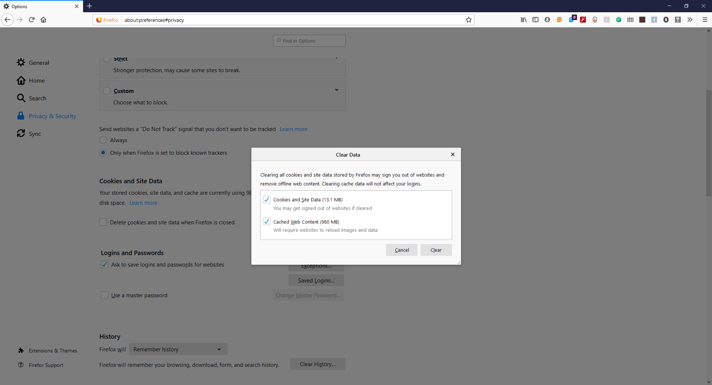

# 🌠 Fix VMware Error Client Session is no Longer Authenticated


ในกรณีที่เราทำการ Login เข้าใช้งาน VMware vCenter แล้วไม่สามารถทำการ Login ได้ ซึ่งจะถูกบังคับให้ทำการ Login ใหม่ ถึงแม้จะทำการ Reinstall Enhanced Authentication Plugin หรือแม้แต่ทำการ Disable Plugin ทั้งหมดแล้วก็ตาม แต่พอลองทำการ Login ด้วย Browser อื่น หรือ ทำการ Login บน Incognito Mode ก็สามารถทำการ Login ได้ปกติ



**Cause** : สาเหตุยังไม่ทราบแน่ชัด ได้ลองทำการค้นหาแล้วแต่ยังไม่สามารถระบุสาเหตุได้ว่าเกิดจากอะไร ซึ่งสาเหตุนี้อาจเกิดได้ทั้ง Google Chrome และ Firefox แต่ยังมีวิธีแก้ ที่สามารถทำได้อย่างปลอดภัย โดยการ Clear Data พวก Cookie and Site Data บน Web Browser


## **Configuration**

* เปิดโปรแกรม Firefox แล้วคลิก Open Menu -> Options -> Privacy & Security -> Clear Data

* เลือก Cookies and Site Data และ Cached Web Content แล้วคลิก Clear

