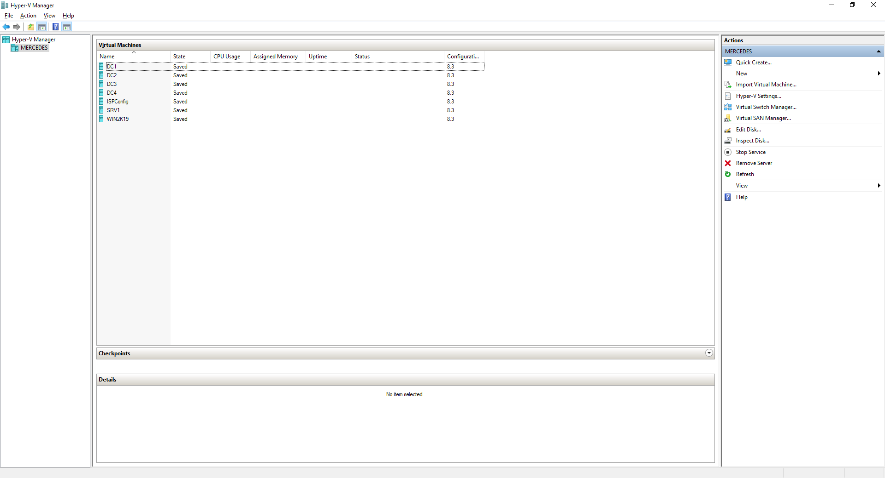
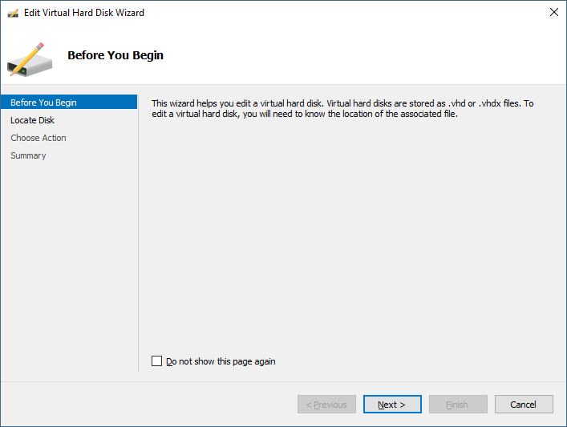
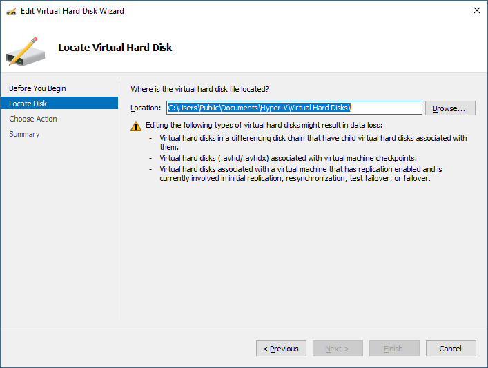
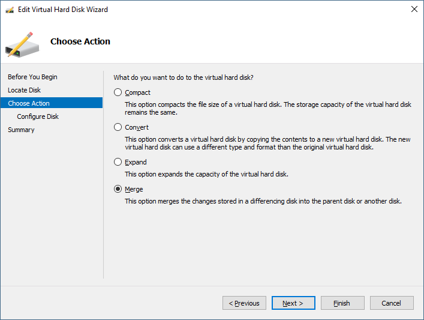
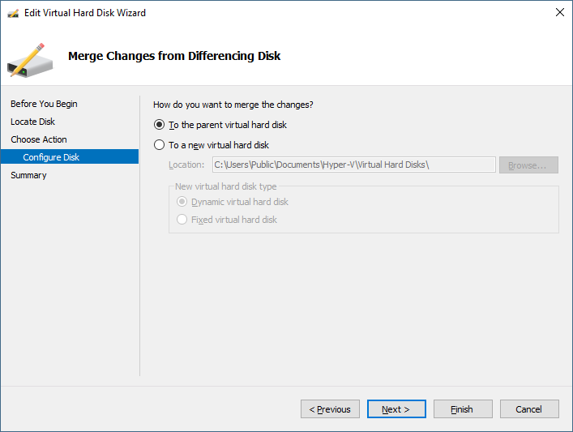
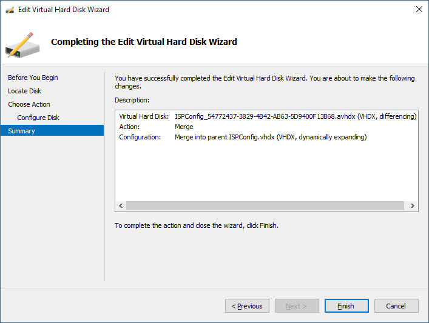

# 🌠 Merge AVHDX and VHDX for Convert to VMDK


หลังจากที่เราได้ลอง Convert จาก VMDK มาเป็น VHDX กันแล้ว เราจะมาลอง Convert จาก VHDX มาเป็น VMDK กันบ้าง โดยปกติการสร้าง Virtual Machine บน Hyper-V จะได้ไฟล์มา 2 ไฟล์ คือ AVHDX และ VHDX ซึ่งจะต้องทำการ Merge ทั้ง 2 ไฟล์เข้าด้วยกันก่อนทำการ Convert


## **Get Started**

* เปิดโปรแกรม Hyper-V Manager เลือก Action แล้วคลิก Edit Disk

* คลิก Next

* เลือก AVHDX ไฟล์ที่ต้องการ Merge แล้วคลิก Next

* เลือก Merge แล้วคลิก Next

* เลือก To the parent virtual hard disk แล้วคลิก Next

* คลิก Finish

* จะเห็น File ที่ถูก Merge เรียบร้อยแล้ว ซึ่งเราสามารถนำไป Convert เป็น VMDK ต่อได้

**อ่านเพิ่มเติม** : [https://bit.ly/2GE2FMb](https://bit.ly/2GE2FMb)
