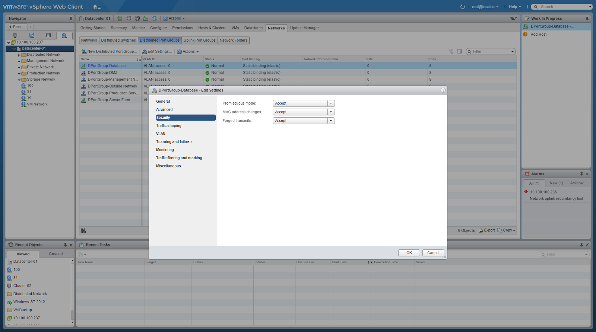

# 🌠 Promiscuous Mode and Forged Transmits on VMware vSphere 6.5


การทำ Nested ESXi ใน VMware ที่บางครั้งเราจำเป็นต้องใช้เนื่องจากในเรื่องของข้อจำกัดต่าง ๆ ซึ่งการใช้งานจำเป็นต้องมี CPU ที่รองรับทั้ง Intel-VT + EPT หรือ AMD-V + RVI และต้องเปิดการใช้งาน Promiscuous Mode และ Forged Transmits บน PortGroup ที่ Nested ESXi เชื่อมต่ออยู่ เรามาทำความรู้จักโหมดที่ว่ากันดีกว่า


## **🌵 Promiscuous Mode**

แปลตรงตัวก็คือโหมดสำส่อน ซึ่งในทาง Network นั้นหมายความว่า เป็นการเปิดโหมดให้รับ Packet ต่าง ๆ ทั้งหมด ที่ส่งมายังการ์ด Network Interface โดยไม่สนว่าข้อมูลที่ถูกส่งมาจำเป็นต้องส่งมาที่ MAC Address ของเรา ซึ่งจากการเปิดโหมดให้รับ Packet ต่าง ๆ ทั้งหมด จะต้องมีปริมาณ Network Throughput เพิ่มขึ้นตามมา ควรจะพิจารณาแยก Environment ของ Nested ESXi ออกมา

## **☘️ Forged Transmits**

เป็นนโยบายความปลอดภัยของ Virtual Switch โดยใช้การ Reject หรือ Accept เพื่อป้องกันการแอบอ้าง MAC หาก MAC ไม่ตรงกันแสดงว่าเกิด Forged Transmits หากกำนดค่าเป็น Reject  ข้อมูล Frame ที่ส่งมาจะถูก Drop

## **🌱 Nested ESXi**

ในการใช้งาน Nested ESXi เราสามารถสร้าง Virtual Switch ได้ทั้งแบบ Virtual Standard Switch และ Virtual Distributed Switch สามารถทำงานได้เหมือนกัน

**อ่านเพิ่มเติม** : [https://bit.ly/2MtQcKO](https://bit.ly/2MtQcKO)
