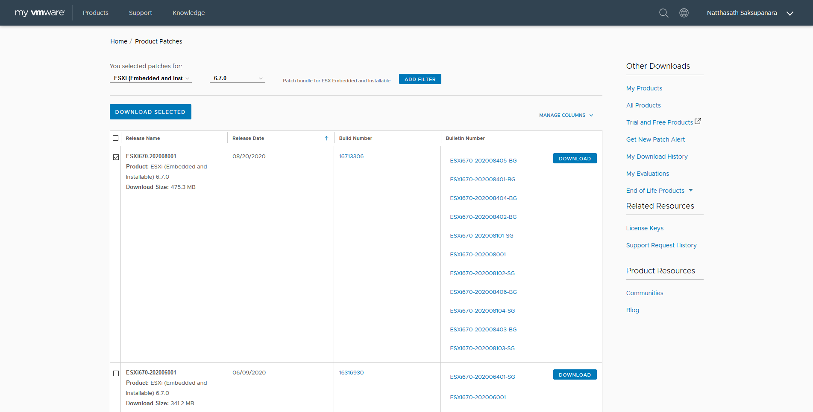
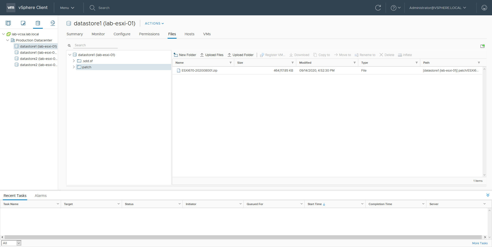
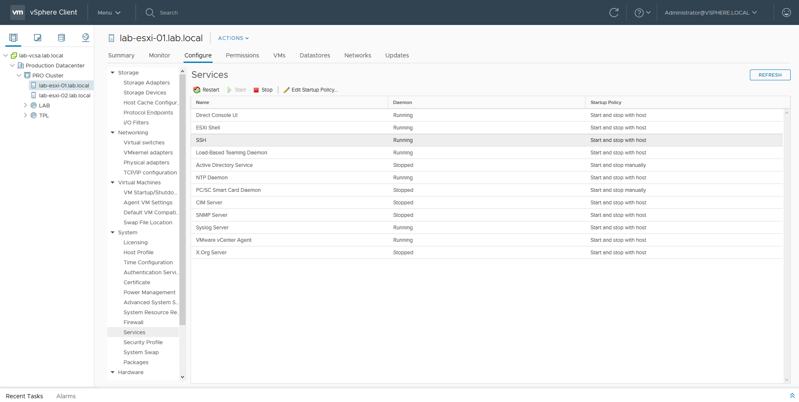

# 🌠 Update Patches on VMware ESXi 6.7 with ESXCLI


โดยปกติการ Update Patches จะแบ่งตามระดับความรุนแรง ( Severity ) ของ Vulnerable เราอาจเลือก Update Patches เฉพาะที่เป็นช่องโหว่ร้ายแรง ( Critical ) ซึ่งเราสามารถดูได้จาก [CVE Detail](https://www.cvedetails.com/) โดยจะบอกถึงรายละเอียดของช่องโหว่ รวมถึง Risk Score ซึ่งบน VMware สามารถทำการ Update Patches ได้ 2 วิธี คือ 1. ผ่านทาง Command Line จะเหมาะกับกรณีที่ Host ไม่เยอะ 2. ผ่านทาง VMware vSphere Update Manager จะเหมาะกับกรณีที่ Host เยอะ


## **Get Started**

* ทำการดาวน์โหลด Patch ผ่านทาง [VMware Patch Portal](https://my.vmware.com/group/vmware/patch#search)



* ทำการ Upload ไปยัง Datastore ของ VMware ESXi



* ทำการ Enable SSH



* ทำการ Update Patches


```
esxcli software vib update -d "/vmfs/volumes/datastore/patch/PatchName.zip"
```



```
Installation Result
Message: The update completed successfully, but the system needs to be rebooted for the changes to be effective.
Reboot Required: true
```


**อ่านเพิ่มเติม** : [https://bit.ly/3mhgKCd](https://bit.ly/3mhgKCd)
